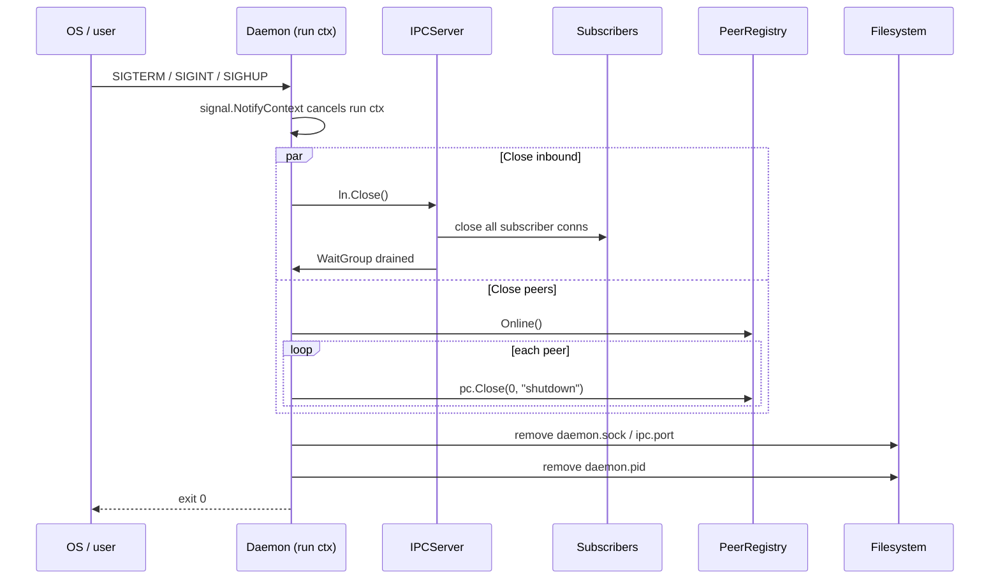
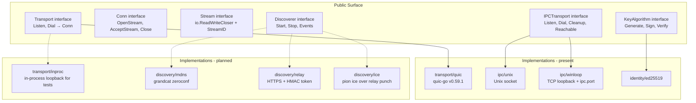
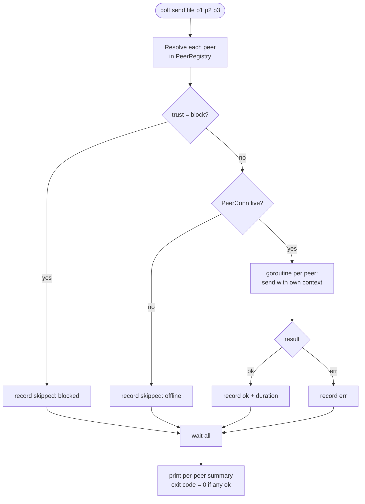

# Architecture Critique — 2026-05-19

Reviewer: System Architect
Scope: `architecture.md` vs `plan.md` vs current code in `internal/` and `cmd/bolt/`.
QA bug-hunt findings (if any) are intentionally not duplicated here; this report
addresses structural, interface, layering, and diagram-accuracy issues only.

---

## Executive summary

- `architecture.md` is a clean *aspirational* picture; it does not reflect the
  code that exists today. Five out of ten internal packages named in `plan.md`
  (`discovery`, `transfer`, `tui`, `relay`, `deploy`) are empty or absent, yet
  the System Overview diagram presents them as live subsystems on equal footing
  with the ones that are implemented.
- The "Windows unsupported" decision in `plan.md` (line 29, 70-71) is silently
  contradicted by real Windows code: `internal/daemon/spawn_windows.go`,
  `internal/daemon/ipc_endpoint_windows.go` (TCP loopback with `ipc.port`).
  The architecture must either commit to a cross-platform `IPCTransport`
  interface or delete the Windows build constraint files.
- The TOFU prompt flow drawn in `architecture.md` (Connection Paths & TOFU
  diagrams) is **not implemented**. `internal/daemon/connect.go:75-83` and
  `internal/daemon/daemon.go:154-176` auto-accept any non-blocked peer; there
  is no `tofu_prompt` IPC event, no out-of-band verification, no randomart
  shown at connect time. This is an architecture-level gap, not just a missing
  CLI feature: there is no event channel in the IPC schema for it.
- The "Transport Layer" box collapses three different responsibilities
  (connection lifecycle, framing/identity-handshake, stream routing) into one
  group. There is no `Transport` interface; the daemon imports `quic-go` types
  (`*quic.Stream`, `*quic.Conn`) directly through `transport.PeerConn`. This
  bakes `quic-go` into every consumer and forecloses WebTransport/HTTP3/test
  loopback swap-out.
- IPC types live in package `daemon` (`internal/daemon/ipc.go`), not in
  `internal/proto/ipc.go` as `plan.md` (line 173, 222-224) prescribes. The CLI
  therefore imports `internal/daemon` to know an IPC command name — the layer
  the diagram says talks to the daemon imports the daemon's own package. This
  is a real layering inversion, not cosmetic.
- Numeric claims in diagrams ("ICE success 75 pct", "auto-found in ~3 seconds")
  are not backed by anything in the code or plan and should be removed or
  replaced with "depends on NAT type" / "typical sub-5s on LAN" wording.

---

## Strengths

These are genuinely good design choices and should be preserved through any
refactor.

- **Identity model**: `internal/identity/identity.go` cleanly separates the
  Ed25519 application identity from the ECDSA wrapper key used because
  `quic-go`'s TLS stack cannot sign with Ed25519 directly. Embedding the public
  key in `SubjectKeyId` and re-verifying it via `ExtractPublicKeyFromCert` is
  the right shape (`internal/identity/identity.go:147-194`).
- **TLS-cert ↔ handshake message cross-check**: `peer_conn.go:111-139`
  re-derives the fingerprint from the application-layer `HandshakeMsg` and
  compares it against the TLS cert's fingerprint. This catches identity
  substitution and deserves to be in the diagrams (it currently is — keep it).
- **Wire framing**: `internal/proto/wire.go` keeps the stream-type byte +
  length-prefixed JSON pattern simple, with `maxFrameSize` ceiling
  (`wire.go:160-198`) and version gating per message. Reasonable as v1.
- **IPC token**: `internal/daemon/ipc_token.go` plus `ipc.go:153-156`
  authenticate the local IPC channel even though the Unix socket is already
  user-scoped. This is small, cheap, and correctly applied on every connection.
  It is *not* shown in the architecture diagram and should be.
- **PID-flock spawn**: `internal/daemon/spawn.go:73-86` correctly takes the
  flock before re-checking the socket, then spawns. This is faithful to the
  "Daemon Auto-Spawn (Race-Safe)" diagram and is one of the few diagrams that
  matches code.
- **Versioning on both files and wire**: both `Config.Version` and `WireVersion`
  exist and the migration helper in `internal/config/config.go:131-167` is
  forward-compatible by design.

---

## Findings (prioritized)

A "P0 — Must fix" item here is something that must change *before* writing more
code on top of the current diagrams, because either (a) the diagram lies in a
way that will cause new contributors to wire things wrong, or (b) an
abstraction is missing that will become exponentially harder to retrofit.

### P0 — Must fix

#### [A-1] Transport interface absent; `quic-go` types leak into daemon and chat

- Location in `architecture.md`: "System Overview" — the `Transport Layer`
  subgraph; absent of any interface boundary annotation.
- Problem: `internal/transport/peer_conn.go` returns concrete `*quic.Stream`
  and stores `*quic.Conn`. Consumers depend on these types directly:
  - `internal/chat/service.go:14, 40, 73, 164` takes `*quic.Stream`.
  - `internal/daemon/daemon.go:17, 203` accepts `*quic.Stream` for routing.
  There is no interface that hides `quic-go`. Any future swap (WebTransport,
  HTTP/3, an in-process test loopback) requires touching every consumer.
- Evidence:
  - `internal/transport/peer_conn.go:155-182` (OpenStream/AcceptStream return
    `*quic.Stream`).
  - `internal/chat/service.go:39-42` (`peerChat.stream *quic.Stream`).
  - `internal/daemon/daemon.go:203-213` (`routeStream` takes `*quic.Stream`).
- Recommendation: define `transport.Stream` and `transport.Conn` interfaces
  (just `io.ReadWriteCloser` plus a `Close(code, msg)` is enough for now). Have
  `PeerConn.OpenStream` / `AcceptStream` return the interface type. Add a
  `Transport` interface for the listener side: `Listen(ctx) (Acceptor, error)`,
  `Dial(ctx, addr) (Conn, error)`. The QUIC implementation becomes one
  `transport/quic` package; a future `transport/inproc` (for tests) and
  `transport/webtransport` become drop-ins.
- Effort: M.

#### [A-2] IPC types in `internal/daemon` violate the layering in the diagram

- Location in `architecture.md`: "System Overview" — `CLI -> SOCK -> DAEMON`
  arrow implies the CLI talks to the daemon over a protocol, not by importing
  the daemon package.
- Problem: `plan.md:173` prescribes `internal/proto/ipc.go` for IPC
  request/response/event types. In the code these types live in
  `internal/daemon/ipc.go` (`IPCRequest`, `IPCResponse`, `IPCEvent`,
  `StatusPayload`, `ConnectPayload`, `SendChatPayload`, `ChatEventPayload`).
  `cmd/bolt/main.go:17` therefore imports `internal/daemon`, which transitively
  pulls in everything the daemon does (chat service, transport, quic-go) into
  the CLI binary just so it can name a command string.
- Evidence:
  - `cmd/bolt/main.go:147, 188, 214, 244` references `daemon.CmdStatus`,
    `daemon.CmdConnect`, `daemon.Subscribe`, `daemon.CmdSendChat`.
  - `internal/daemon/ipc.go:14-75` — all IPC types declared in `package daemon`.
- Recommendation: move IPC request/response/event types and the IPC framing
  helpers (`writeIPCFrame`/`readIPCFrame`) to `internal/proto/ipc.go`. Keep
  only the *server* (`IPCServer`, `acceptLoop`, `dispatch`, `handleConn`) and
  *client* (`IPCClient`, `Connect`, `Send`) in `internal/daemon`. Better still:
  split client to `internal/daemonclient/` so the CLI never imports the daemon
  package at all.
- Effort: S.

#### [A-3] TOFU prompt flow drawn but not implemented; no IPC event for it

- Location in `architecture.md`: "Connection Paths" (PROMPT → SAVE branch) and
  "TOFU Identity Verification" sequence diagram.
- Problem: Both diagrams show "Show fingerprint and randomart" then "User types
  y to accept" then "Save to peers.toml". The current code auto-accepts every
  non-`block` peer:
  - `internal/daemon/connect.go:75-83`: `peerVerifier` returns `(true, nil)`
    unless trust is exactly `TrustBlock`.
  - `internal/daemon/daemon.go:154-176`: incoming peers are passed straight to
    `Handshake` without a verifier callback.
  - `savePeerRecord` (`connect.go:85-106`) silently writes `TrustAllowOnce` to
    `peers.toml` for any new peer — first-use is *implicit*, not "on-first-use
    with confirmation".
  IPC schema in `daemon/ipc.go` has no `tofu_prompt` event or `tofu_response`
  command, despite `plan.md:224` listing both.
- Evidence: `internal/daemon/connect.go:75-83`, `internal/daemon/daemon.go:154-176`,
  `internal/daemon/ipc.go:12-20` (commands) and `:39-50` (events).
- Recommendation: this is two architecture changes, not one bug. (1) Add a
  `TOFU` subsystem to `internal/daemon` (or `internal/identity/tofu`) with a
  blocking decision channel keyed by fingerprint. (2) Extend the IPC contract:
  add `IPCEventTOFUPrompt{Fingerprint, Nickname, Randomart, DeadlineUTC}` and
  `IPCCmdTOFUResponse{Fingerprint, Accept bool}`. The architecture diagram
  must show the prompt as a *cross-process* round-trip (daemon → IPC event →
  CLI → IPC command → daemon), not as a local function call.
- Effort: M.

#### [A-4] "Transport Layer" subgraph conflates three responsibilities

- Location in `architecture.md`: "System Overview" — `QUIC`, `TLS`, `PC` in one
  cluster, linked as `QUIC → TLS → PC`.
- Problem: The current `internal/transport` package contains:
  1. *Listen/dial wrappers around quic-go* (`quic.go`) — connection lifecycle.
  2. *TLS config + TOFU `VerifyPeerCertificate` callback* (`tls.go`) —
     identity at handshake time.
  3. *Application-level handshake + per-connection state* (`peer_conn.go`) —
     post-handshake identity binding and stream routing.
  4. *Local-peer struct* (`local.go`) — just a value type.
  These are three concerns: connection (1), identity (2,3 partially), and
  stream multiplexing (3). The diagram order is also misleading: `QUIC → TLS →
  PeerConn` suggests a pipeline, but `TLS` is *inside* QUIC and `PeerConn`
  wraps the QUIC connection — it is not downstream of TLS.
- Evidence: `internal/transport/quic.go:42-61`, `tls.go:29-67`,
  `peer_conn.go:27-188`.
- Recommendation: redraw "Transport Layer" with three sub-boxes:
  1. *Transport (QUIC listener/dialer)* — `transport/quic.go`.
  2. *Cert + TOFU* — `transport/tls.go` plus `internal/identity` callouts;
     position this *inside* the Transport box.
  3. *Session* — `transport/peer_conn.go` (application handshake, stream open
     /accept, registry). Position this *above* Transport, not inside it.
  Annotate the arrows so readers can see that TLS verification runs as a
  callback during QUIC's handshake, not as a separate downstream step.
- Effort: S (diagram-only).

#### [A-5] Windows code exists despite "Windows unsupported in v1"

- Location in `architecture.md`: "System Overview" labels Unix Socket
  `daemon.sock`; `plan.md:29, 70-71` says Linux + macOS only.
- Problem: The repo already contains:
  - `internal/daemon/spawn_windows.go` (CREATE_NEW_PROCESS_GROUP).
  - `internal/daemon/ipc_endpoint_windows.go` (TCP loopback + `ipc.port` file).
  - The README (`README.md:29, 46-54, 66`) advertises Windows installs and a
    PowerShell one-liner.
  Reality is that the project *is* shipping Windows, but the architecture
  document still pretends it isn't, and there is no `IPCTransport` abstraction
  to make the two implementations interchangeable cleanly.
- Evidence: `internal/daemon/ipc_endpoint_windows.go:25-72`,
  `internal/daemon/spawn_windows.go:1-15`, `README.md:29-66`.
- Recommendation: pick one and commit:
  - Option A — accept Windows is supported. Update `plan.md` and the
    architecture diagram. Introduce a real `IPCTransport` interface
    (`Listen(configDir) (net.Listener, error)`, `Dial(configDir) (net.Conn,
    error)`, `Cleanup(configDir)`, `Reachable(configDir) bool`) and wire both
    implementations through it. Mention named pipes as an evolution path.
  - Option B — delete the Windows code, drop the install lines from README,
    add `//go:build !windows` to the `cmd/bolt/main.go` build, document the
    decision.
  Either way the diagram must stop showing a single `daemon.sock` box.
- Effort: M (Option A) / S (Option B).

#### [A-6] Discovery subgraph diagrammed without code; `mDNS → DAEMON2` arrows are speculative

- Location in `architecture.md`: "System Overview" — `Discovery` subgraph
  containing `MDNS`, `RELAY`, `ICE`, `TURN`; "Connection Paths" — entire
  internet branch.
- Problem: `internal/discovery/` is empty, `relay/` is absent, and there is no
  `internal/transport/ice.go`. The diagrams therefore describe an architecture
  that has not been built and has no committed interface yet. New developers
  will assume `mDNS → DAEMON` connects through some `Discoverer` abstraction
  the daemon already exposes; there is no such thing.
- Evidence: `ls internal/discovery internal/transfer internal/tui` — all
  empty directories (verified). `go.mod` does not depend on `grandcat/zeroconf`
  or `pion/ice` (`go.mod:5-18`).
- Recommendation: (1) Mark the Discovery and ICE/TURN nodes in the diagrams
  with a clearly visible "planned" badge (e.g. dashed outline + label). (2)
  Before writing `internal/discovery/`, define a `Discoverer` interface in
  `architecture.md` so mDNS, relay, gossip, DNS-SD, and manual-connect all
  plug into the same surface:
  ```
  type Discoverer interface {
      Start(ctx context.Context, announce Announce) error
      Stop() error
      Events() <-chan DiscoveryEvent // online/offline/updated
  }
  ```
  The daemon talks to `[]Discoverer`, not to mDNS and relay specifically.
- Effort: S for diagram, M for the interface design ADR.

#### [A-7] No diagram covers shutdown, signal propagation, or goroutine ownership

- Location in `architecture.md`: missing entirely.
- Problem: The daemon spawns several goroutines (accept loop, per-connection
  serve, per-stream route, chat reader, IPC accept loop, per-IPC-conn handler,
  subscribers map). Some live for the daemon lifetime; some for the connection
  lifetime; some per request. Signal handling exists
  (`daemon.go:53-86`) but the cancellation path is not documented anywhere:
  - `ctx` from `signal.NotifyContext` is passed into `acceptLoop`, but
    `chat.Service.connCtx` is captured separately and used to spawn reader
    goroutines (`chat/service.go:48-50, 157-160`).
  - `IPCServer.handleSubscribe` runs a `conn.Read` loop with no ctx
    (`daemon/ipc.go:168-187`) — subscribers will not be cleanly cancelled.
  - `cleanupIPC` removes the socket file but `spawnDaemon` writes
    `daemon.pid` (`spawn.go:53-57`) that is never removed on shutdown.
- Evidence: `internal/daemon/daemon.go:52-86, 215-219`,
  `internal/chat/service.go:48-50, 137-161`,
  `internal/daemon/ipc.go:168-187`,
  `internal/daemon/spawn.go:53-57` (write only, no removal in cleanup).
- Recommendation: add a "Graceful Shutdown" sequence diagram (sketch supplied
  below) and an "Ownership and Lifecycle" section to `architecture.md` with a
  small table:
  | Goroutine                       | Parent ctx           | Triggered by      | Stops when                |
  |---------------------------------|----------------------|-------------------|---------------------------|
  | `acceptLoop`                    | daemon run ctx       | `Run()`           | listener closed           |
  | `handleIncomingPeer`            | daemon run ctx       | new QUIC conn     | conn closed               |
  | `servePeer`/`serveStreams`      | daemon run ctx       | per peer          | conn closed               |
  | `routeStream`                   | daemon run ctx       | per stream        | stream closed             |
  | `chat.AttachStream` reader      | `chat.connCtx`       | first stream      | read err or ctx done      |
  | `IPCServer.acceptLoop`          | (no ctx — bug)       | server start      | listener closed           |
  | `handleSubscribe` read-pump     | (no ctx — bug)       | per subscriber    | conn read returns err     |
  Also: remove `daemon.pid` in `shutdown()` (architectural cleanup, not a bug
  fix: the ownership of the pid file is currently split between `spawn.go` and
  no one).
- Effort: S for diagram, M for the lifecycle audit.

### P1 — Should fix

#### [A-8] `internal/transport/peer_conn.go` mixes connection state and a global registry

- Location: "System Overview" — `REG` box.
- Problem: `PeerRegistry` lives in package `transport` next to `PeerConn`. The
  registry is daemon-scoped state (one per daemon process) and is read/mutated
  by `internal/daemon/daemon.go:155-216`. Putting it in `transport` is a
  layering smell — the transport layer does not need to know that some upper
  layer keeps a global map of authenticated peers.
- Evidence: `internal/transport/peer_conn.go:192-274`.
- Recommendation: move `PeerRegistry` to `internal/daemon/registry.go` (or
  `internal/discovery/registry.go` per `plan.md:154`). Keep `PeerConn` in
  `transport`. This shrinks `transport`'s public surface to two real things:
  a connection and a stream.
- Effort: S.

#### [A-9] No `Discoverer` / `IPCTransport` / `Storage` interfaces defined

- Location: implied throughout the diagrams; not enumerated.
- Problem: bolt is being designed as a multi-implementation system (LAN +
  internet + manual; Unix socket + TCP loopback; toml + SQLite for relay) but
  no interfaces are drawn. Each is a future swap surface.
- Recommendation: add a single "Interfaces" diagram to `architecture.md` with
  these contracts:
  - `Transport` (Listen/Dial → Conn/Stream).
  - `IPCTransport` (Listen/Dial/Cleanup/Reachable).
  - `Discoverer` (Start/Stop/Events).
  - `KeyAlgorithm` (Generate/Sign/Verify/Marshal/PublicKey) — for post-quantum
    migration headroom; Ed25519 is the only impl today.
  - `RelayClient` (Register/Heartbeat/Lookup/Punch).
  Implementations referenced from each box in the System Overview.
- Effort: M.

#### [A-10] Wire protocol version is per-message, not per-connection

- Location: "Wire Protocol" subgraph in the System Overview; `plan.md:37-38`.
- Problem: Every message carries `"v":1`. This is mildly wasteful but more
  importantly *the wrong layer for a capability handshake*. The TLS ALPN
  already negotiates `bolt/1` (`internal/transport/tls.go:23`). Capabilities
  should be negotiated once during the initial handshake stream, not on every
  payload. Per-message v makes parallel-version coexistence (v1 + v2 messages
  on the same connection) easier — but `peer_conn.go:111-117` rejects the
  connection if the *handshake* `V` differs, so there is no per-message
  negotiation today either way.
- Recommendation: keep `WireVersion` for the handshake message, drop the
  per-message `v` field from v2 onwards. Add a `Capabilities []string` field
  to `HandshakeMsg` (e.g. `["chat/1","file/1","control/1"]`). Bumping
  individual sub-protocols then no longer requires bumping the whole wire
  version. Document this in an ADR before changing it; the change is
  forward-compatible because v1 receivers already ignore unknown fields.
- Effort: S (after ADR).

#### [A-11] No back-pressure or flow-control story for file transfer

- Location: "File Transfer Flow" diagram.
- Problem: The diagram shows 8 parallel chunk streams firing concurrently with
  no representation of buffering, slow-receiver back-pressure, or
  cancellation. With 4 MB chunks × 8 streams = 32 MB minimum in-flight per
  transfer, multiplied by parallel peer count. The transfer package is empty
  so this is the right time to put the limit in the architecture rather than
  discover it in production.
- Recommendation: add a "Flow control" callout to the diagram. Pick a model
  and write it down: bounded chunk-work-queue (capacity = N streams), receiver
  ACKs every chunk (back-pressure is QUIC's flow control + a small app-level
  credit window), per-peer concurrent-transfer cap (e.g. 2). Put this in a
  `Transfer` interface so `internal/transfer/sender.go` is one
  implementation. Also call out: TURN path has 256 KB chunks but does NOT halve
  the 8 streams — that's potentially abusive on a relay. Decide.
- Effort: M.

#### [A-12] Chat ring buffer (1000 msgs/peer) is in plan; subscriber lag eviction is not

- Location: "System Overview" arrow `SOCK ↔ DAEMON`.
- Problem: `plan.md:296` specifies a 1000-msg ring buffer per peer for chat
  history before a subscriber attaches. The current code in
  `internal/chat/service.go` has *no* buffer — incoming messages are emitted
  to handlers synchronously (`service.go:62-69, 104-110`) and dropped if no
  subscriber is connected. `IPCServer.PublishChat` also writes to subscribers
  synchronously inside the `subsMu` lock (`ipc.go:116-130`) — one slow
  subscriber blocks publication to all others.
- Evidence: `internal/chat/service.go:62-110`,
  `internal/daemon/ipc.go:116-130`.
- Recommendation: add a "Subscriber lifecycle" diagram (sketch below) covering
  attach → buffered backlog → live stream → slow-subscriber eviction policy.
  Decide: drop oldest (ring-buffer), drop newest (head-of-line), or
  per-subscriber bounded queue with disconnect on overflow. Architecture
  should commit, not implementation.
- Effort: S diagram + S code-spec.

#### [A-13] Hard-coded numbers in diagrams ("ICE success 75 pct", "auto-found in ~3 seconds")

- Location: "System Overview" `ICE -->|fails 25 pct| TURN`; "Connection Paths"
  `mDNS Discovery\nauto-found in ~3 seconds`, `ICE_TRY -->|Success 75 pct|`.
- Problem: No measurement, no citation, no source. mDNS announce/browse cycle
  on most networks is <1s on a wired LAN, sometimes >10s on WiFi with sleep.
  ICE success rates depend on NAT topology, not a global constant.
- Recommendation: replace with qualitative labels: "fast on LAN, depends on
  multicast"; "fails on symmetric NAT or CGNAT"; remove the percentages.
- Effort: S.

#### [A-14] No observability story

- Location: missing from `architecture.md` entirely.
- Problem: Debugging a P2P transport remotely is impossible without structured
  logs and counters. The current code uses `fmt.Fprintf(os.Stderr, ...)` ad
  hoc: `daemon.go:80, 131, 141, 188, 190, 210`, `connect.go:104`,
  `spawn.go:56`. There is no leveling, no JSON output, no counters.
- Recommendation: add an "Observability" section. Minimum:
  - Adopt `log/slog` (stdlib, Go 1.25 — already on `go.mod:3`). Replace all
    `fmt.Fprintf(os.Stderr, ...)` with `slog` calls. Default text handler;
    JSON when `BOLT_LOG=json`.
  - Counters (in-memory + exposed via `bolt status`):
    `peers_connected_total`, `peers_disconnected_total`,
    `tls_handshake_failures_total`, `tofu_prompts_total`,
    `tofu_accepted_total`, `tofu_rejected_total`,
    `chat_messages_sent_total`, `chat_messages_received_total`,
    `transfer_bytes_sent_total{path=lan|turn}`, `transfer_bytes_received_total`.
  - `bolt status` JSON schema versioned with the rest of the wire.
- Effort: M.

#### [A-15] No public `pkg/` surface; README claims "Open source client"

- Location: project layout, `architecture.md` does not address.
- Problem: Everything is under `internal/` so nothing can be imported by other
  Go programs. `README.md:80` says "Open source client (this repo)". If bolt
  is also intended as a library (the user query mentioned "library/tool"),
  the architecture must carve out a public surface.
- Recommendation: discuss in an ADR. Likely shape:
  - `pkg/bolt/` — exposes `bolt.Identity`, `bolt.Client` (a wrapper over
    `IPCClient`), `bolt.Event`, `bolt.Peer`. Imports from `internal/proto`
    only.
  - `pkg/bolt/transfer/` — high-level send/receive callables for embedding in
    other tools.
  - Everything daemon-internal stays in `internal/`.
  If library is not a goal, say so in `architecture.md` and stop using the
  word "library".
- Effort: M.

### P2 — Nice to have

#### [A-16] No relay TLS / cert-pinning flow diagram

- Location: missing.
- Problem: `plan.md:97-98, 321` documents Let's Encrypt-or-pinned-self-signed
  relay TLS plus `relay_cert_fingerprint` in config. There is no diagram for
  it, and the field exists in `internal/config/config.go:60-61` already.
- Recommendation: add a small "Relay registration + HMAC token" sequence
  diagram (sketch below) that includes cert-fingerprint pinning.
- Effort: S.

#### [A-17] No NAT keepalive lifecycle in diagrams

- Location: System Overview / Connection Paths.
- Problem: `transport.quicConfig()` sets `KeepAlivePeriod: 15s`
  (`internal/transport/quic.go:32`) but the architecture diagrams do not
  mention keepalives. Future maintainers will not know why a connection lingers
  for 5 minutes after the peer goes offline.
- Recommendation: add a one-liner annotation on `PC` (or its replacement
  `Session` box): "keepalive 15s; idle timeout follows quic-go default".
- Effort: S.

#### [A-18] No documented testing-architecture surface

- Location: missing.
- Problem: `plan.md:100-101` lists test goals; nothing in the architecture
  shows how two daemons run in one test binary, or where the loopback
  transport hooks in. With `Transport` and `IPCTransport` interfaces (A-1,
  A-5) added, this becomes natural; without them, integration tests will reach
  into `internal/transport` types.
- Recommendation: add a short "Test harness" subsection: `transport/inproc`
  implementation, an `IPCTransport/inproc` implementation, helper
  `daemonpair_test` that wires two `daemon.Daemon` instances together
  in-process for end-to-end assertions.
- Effort: M.

#### [A-19] `peers.toml` write strategy is not atomic

- Location: "Data Storage" box — `PEERS` node.
- Problem: `flushLocked` uses `O_WRONLY|O_CREATE|O_TRUNC` then writes
  (`internal/config/peers.go:207-216`). On crash mid-write the file is
  truncated and the peer list is lost.
- Recommendation: this is an architecture-relevant change because it requires
  introducing a small persistence primitive. Add a one-line guidance in
  `architecture.md`: "All TOML writes go through `writeAtomic(path, data)` —
  write to `path.tmp`, fsync, rename." Use it for `config.toml` and
  `peers.toml`. (Bug-level fix, but the policy is architectural.)
- Effort: S.

#### [A-20] `cmd/bolt/main.go` chat command bypasses TUI / bubbletea

- Location: not addressed in any diagram.
- Problem: `cmd/bolt/main.go:201-260` implements `bolt chat` with raw
  `bufio.Scanner` and `fmt.Print("> ")`. `plan.md:299-301` mandates a
  bubbletea TUI with viewport + textinput + resize handling. The current
  implementation will not survive `tea.WindowSizeMsg` or paste handling and
  has no separation between the IPC subscriber goroutine and the input loop.
- Recommendation: introduce `internal/tui/` per plan, with a `ChatModel` that
  consumes `IPCEvent`s as `tea.Msg`s. The diagram should show the CLI/TUI as
  *two* surfaces, not one: a thin one-shot CLI for status/peers/connect, and a
  long-lived TUI for chat. Document the seam.
- Effort: M.

---

## Proposed diagram additions (paste-ready mermaid)

### 1. Graceful shutdown sequence



### 2. IPC subscriber lifecycle

```mermaid
sequenceDiagram
    participant CLI
    participant IPC as IPCServer
    participant DAEMON as Daemon

    CLI->>IPC: Subscribe (token-authenticated)
    IPC->>IPC: register conn in subs map
    Note over IPC: send recent ring-buffer backlog (capacity 1000/peer)
    loop while alive
        DAEMON->>IPC: PublishChat(evt)
        IPC->>CLI: IPCEvent{Type:"chat", ...} (non-blocking; per-sub queue)
        alt subscriber queue full
            IPC->>IPC: evict subscriber, close conn
        end
    end
    CLI--xIPC: client disconnect
    IPC->>IPC: remove from subs map
```

### 3. TLS-cert ↔ HandshakeMsg cross-check

```mermaid
sequenceDiagram
    participant A as Local (dialer)
    participant TLS as TLS handshake (inside QUIC)
    participant APP as Application handshake
    participant B as Remote peer

    A->>B: QUIC ClientHello (ALPN bolt/1)
    B-->>A: ServerHello + cert (Ed25519 pubkey in SubjectKeyId)
    Note over TLS: VerifyPeerCertificate extracts pubkey;<br/>computes fingerprint;<br/>consults PeerStore (block? prompt? allow?)
    TLS-->>A: handshake done; fingerprint pinned in PeerConn

    A->>B: OpenStream(StreamHandshake) + HandshakeMsg{public_key_hex, ...}
    B->>A: HandshakeMsg{public_key_hex, ...}
    Note over APP: cross-check fingerprint(HandshakeMsg.public_key) == PeerConn.peerFingerprint
    alt mismatch
        APP-->>A: abort: identity substitution detected
    else match
        APP-->>A: PeerConn ready; registry.Add
    end
```

### 4. Relay registration + HMAC token + cert pinning

```mermaid
sequenceDiagram
    participant N as bolt node
    participant CFG as config.toml
    participant R as boltd relay (HTTPS)

    N->>CFG: load relay URL + relay_cert_fingerprint
    N->>R: TLS dial; pin cert against fingerprint
    alt fingerprint mismatch
        N--xR: abort + warn user (relay swap attack)
    else fingerprint ok
        N->>N: compute token = HMAC-SHA256(relay_secret_per_peer, peer_fingerprint)
        Note over N: peer's relay_secret is derived/provisioned out-of-band
        N->>R: POST /register {fingerprint, ip, token}
        R->>R: verify HMAC; check blocklist; rate limit (10 req/s, burst 100)
        R-->>N: 200 OK
        loop every 30s
            N->>R: POST /heartbeat {fingerprint, token}
        end
        Note over R: prune peers older than 90s every 60s
    end
```

### 5. Transport / IPCTransport / Discoverer interface view



### 6. Multi-peer fan-out failure handling (for `bolt send` / `bolt chat --all`)



---

## Proposed ADRs to create under `docs/adr/`

Do not create the files yet — wait for sign-off. The proposed ADR list:

- **ADR-001: Introduce a `Transport` interface and isolate `quic-go` imports.**
  Context: the codebase imports `*quic.Conn` and `*quic.Stream` from
  `internal/chat` and `internal/daemon` directly. Decision: define
  `transport.Conn`, `transport.Stream`, `transport.Transport` in
  `internal/transport`; refactor `PeerConn` to expose only those interfaces;
  move the QUIC implementation into `internal/transport/quic`. Enables
  test-loopback, future WebTransport, and clearer layering.

- **ADR-002: `IPCTransport` abstraction; commit on Windows.**
  Context: `daemon.sock` on Unix, TCP loopback (`ipc.port`) on Windows; the
  plan still says Windows is unsupported. Decision: support Windows via the
  loopback implementation, add an `IPCTransport` interface, document both
  implementations in the architecture, and remove the Windows-unsupported
  language from `plan.md`. Path forward to named pipes is noted but not done.

- **ADR-003: TOFU prompt as an IPC round-trip.**
  Context: the diagrams show an interactive prompt; the code auto-accepts.
  Decision: introduce a per-fingerprint pending-decision map in the daemon, a
  new `IPCEventTOFUPrompt` event, and an `IPCCmdTOFUResponse` command with a
  30 s deadline. Specify the exact randomart-in-event payload (use
  `identity.FormatIdentityBlock`).

- **ADR-004: Move IPC types to `internal/proto` and split daemon client.**
  Context: `cmd/bolt` imports `internal/daemon` just for command-name
  constants. Decision: move IPC request/response/event types and framing
  helpers to `internal/proto/ipc.go`; move `IPCClient` to
  `internal/daemonclient/`. The CLI then imports only proto + daemonclient.

- **ADR-005: Per-message `"v":1` → handshake-level capabilities.**
  Context: every wire message carries `"v":1`; capabilities are not
  negotiated. Decision: for v2 wire, keep `V` on `HandshakeMsg` only, add
  `Capabilities []string` to advertise per-feature versions, deprecate per-
  message `v` field (kept readable but no longer written).

- **ADR-006: `Discoverer` interface and the mDNS / relay / manual trio.**
  Context: discovery currently has no code and the diagrams treat mDNS, relay,
  ICE, and TURN as siblings. Decision: introduce `Discoverer` interface with
  Start/Stop/Events; mDNS, relay-lookup, manual-connect, and a future gossip
  are each `Discoverer` implementations. Daemon owns `[]Discoverer`.

- **ADR-007: `KeyAlgorithm` abstraction for post-quantum migration headroom.**
  Context: `internal/identity` is hard-bound to Ed25519. Decision: introduce
  a `KeyAlgorithm` interface (Generate / Sign / Verify / MarshalPublic /
  UnmarshalPublic / Fingerprint). Ed25519 is the only impl in v1. Migration
  story: a peer's algorithm is part of the fingerprint domain-separator so a
  PQ migration is forward-compatible.

- **ADR-008: Goroutine ownership + graceful shutdown contract.**
  Context: signal handling exists but the cancellation graph is undocumented;
  `daemon.pid` is not removed on shutdown; `handleSubscribe` ignores ctx.
  Decision: every long-running goroutine takes a `context.Context`; every
  resource has an explicit owner in a single shutdown table; `shutdown()`
  removes `daemon.pid` along with the socket file.

- **ADR-009: Observability baseline.**
  Context: ad-hoc `fmt.Fprintf(os.Stderr, ...)` everywhere. Decision: adopt
  `log/slog`; define counter names and `bolt status` JSON schema; require new
  features to register counters at construction time.

- **ADR-010: Atomic TOML writes for `config.toml` and `peers.toml`.**
  Context: `O_WRONLY|O_CREATE|O_TRUNC` write strategy will corrupt the file
  on crash. Decision: introduce `writeAtomic(path, data)` (write to
  `path.tmp`, fsync, rename) and route all TOML writes through it.

- **ADR-011: Public `pkg/bolt` API surface (or commit to internal-only).**
  Context: README calls bolt a "library/tool"; everything is `internal/`.
  Decision: either carve out `pkg/bolt` (with `Client`, `Identity`,
  `Transfer`) or remove the library framing from the README and architecture.

---

## Drift between `architecture.md`, `plan.md`, and code

| Claim in `architecture.md` | Reality in `plan.md` | Reality in code |
|---|---|---|
| "Unix Socket `daemon.sock`" (System Overview) | Windows unsupported in v1 (`plan.md:29, 70-71`) | Both Unix socket (`ipc_endpoint_unix.go:24`) and Windows TCP loopback (`ipc_endpoint_windows.go:25-72`) implemented; `cmd/bolt` builds on Windows; README documents Windows install. |
| No mention of IPC token in any diagram | Not in `plan.md` | IPC token enforced on every connection (`internal/daemon/ipc_token.go`, `ipc.go:153-156`). |
| "Show fingerprint and randomart to user; user accepts" (Connection Paths, TOFU sequence) | "TOFU prompt with randomart; second connection → no prompt" (`plan.md:248`); IPC event `tofu_prompt` + command `tofu_response` (`plan.md:224`) | No prompt; `peerVerifier` auto-accepts non-blocked (`internal/daemon/connect.go:75-83`); incoming connections do not invoke a verifier at all (`daemon.go:154-176`); IPC schema has no `tofu_prompt` / `tofu_response` (`internal/daemon/ipc.go:12-50`). |
| "mDNS / Relay / ICE / TURN" subgraph as live | Phases 3 + 5 (`plan.md:273-329`) | `internal/discovery/`, `internal/transport/ice.go`, `relay/` all absent. |
| "PeerConn", "Stream Framing" as transport-layer concerns | `internal/proto/ipc.go` for IPC types (`plan.md:173`) | IPC types in `internal/daemon/ipc.go`, not `internal/proto/`. |
| "ICE success 75 pct", "auto-found in ~3 seconds" | "ICE/hole-punch may fail on symmetric NAT + CGNAT" (`plan.md:384`) | No measurement; no implementation. |
| File transfer diagram with "8 parallel QUIC streams, 4MB chunks" | Phase 2 (`plan.md:252-269`); path-aware chunk size (`plan.md:88-89`) | `internal/transfer/` is empty. |
| "Chat ring buffer" implied by `SOCK ↔ DAEMON` arrow | "ring buffer (1000 msgs/peer)" (`plan.md:296`) | No buffering; `Service.emit` is synchronous (`chat/service.go:62-69`); `IPCServer.PublishChat` holds `subsMu` while writing to all subscribers (`ipc.go:116-130`). |
| "Stealth mode" (no diagram callout) | Suppresses mDNS + relay registration (`plan.md:62`) | `Config.Stealth` field exists (`config/config.go:67-69, 85`) but is referenced nowhere else — no enforcement. |
| "Default port 7799" | Same | Same — `config.DefaultPort = 7799` (`config/config.go:25`). |
| "`daemon.pid` flock-protected" | Same | Flock taken (`spawn.go:73-86`) but the pid file is *not* removed on shutdown — `cleanupIPC` only removes the socket (`ipc_endpoint_unix.go:42-44`). |
| "Application Handshake — verify Ed25519 matches TLS cert" | Same | Correctly implemented (`peer_conn.go:111-139`). |
| `cmd/boltd/main.go` (relay binary) in project structure (`plan.md:128-130`) | Same | Not present (`ls cmd/` shows only `bolt/`). |
| `internal/transfer/`, `internal/tui/`, `internal/discovery/` populated (`plan.md:140-173`) | Same | All three are empty directories. |
| Chat command implemented via bubbletea TUI (`plan.md:299-301`) | Same | `cmd/bolt/main.go:201-260` uses raw `bufio.Scanner` and `fmt.Print("> ")`. |
| "Default trust for new peer = allow-once after confirmation" | Same (`plan.md:22`) | Trust is written `allow-once` *without* confirmation (`connect.go:88-92`). |
| Receive-dir "no overwrite, append `_1`/`_2`" policy (`plan.md:86`) | Same | No code; transfer package empty. |

---

## Notes on what is intentionally out of scope here

- Per-line bugs (off-by-one, nil-checks, missing errors). The parallel QA
  bug-hunt is responsible for those.
- Specific code refactors below the package-and-interface level.
- Performance benchmarks. The numeric claims in diagrams should be removed
  rather than measured.
- Relay server implementation details (HMAC computation, SQLite schema): those
  belong in their own design pass once `relay/` exists.
