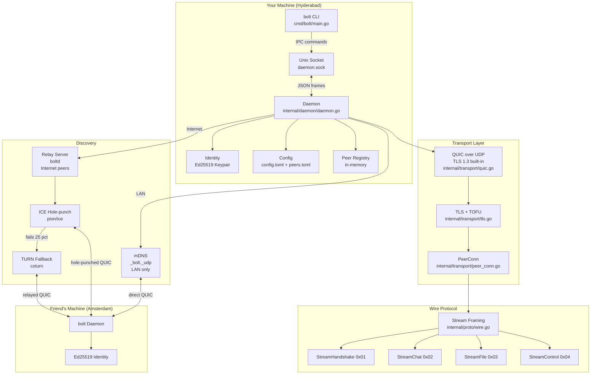
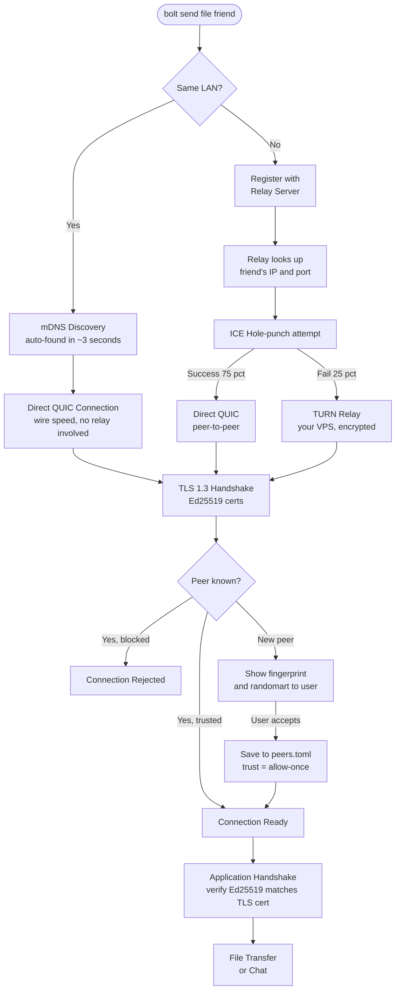
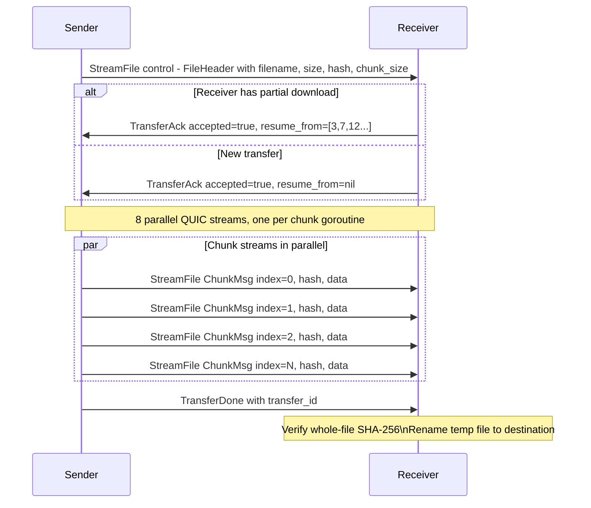
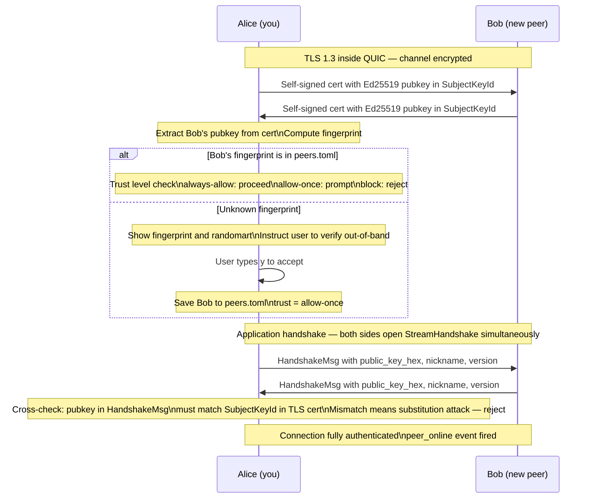
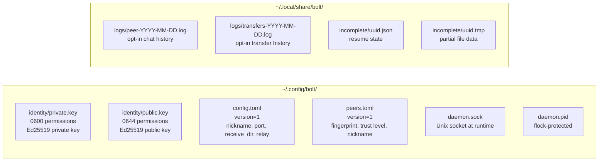
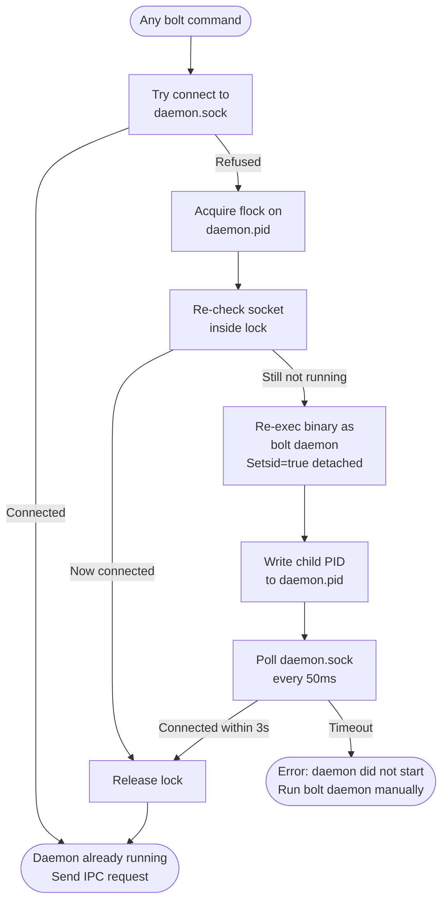

# bolt — Architecture Diagram

## System Overview

---

## Connection Paths

---

## File Transfer Flow

---

## TOFU Identity Verification

---

## Data Storage

---

## Daemon Auto-Spawn (Race-Safe)

